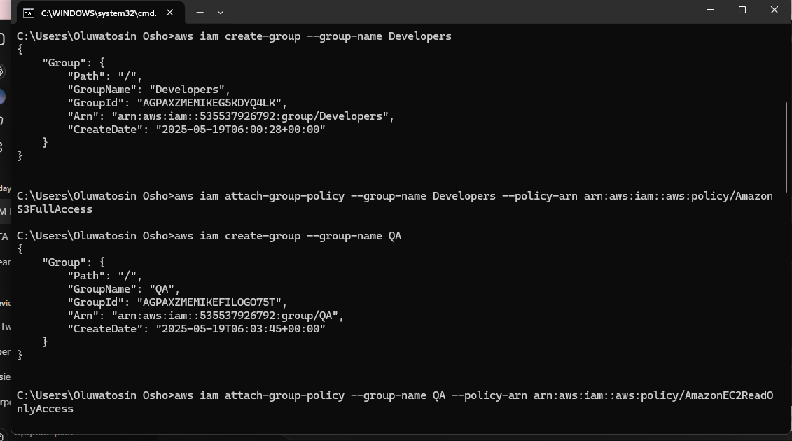
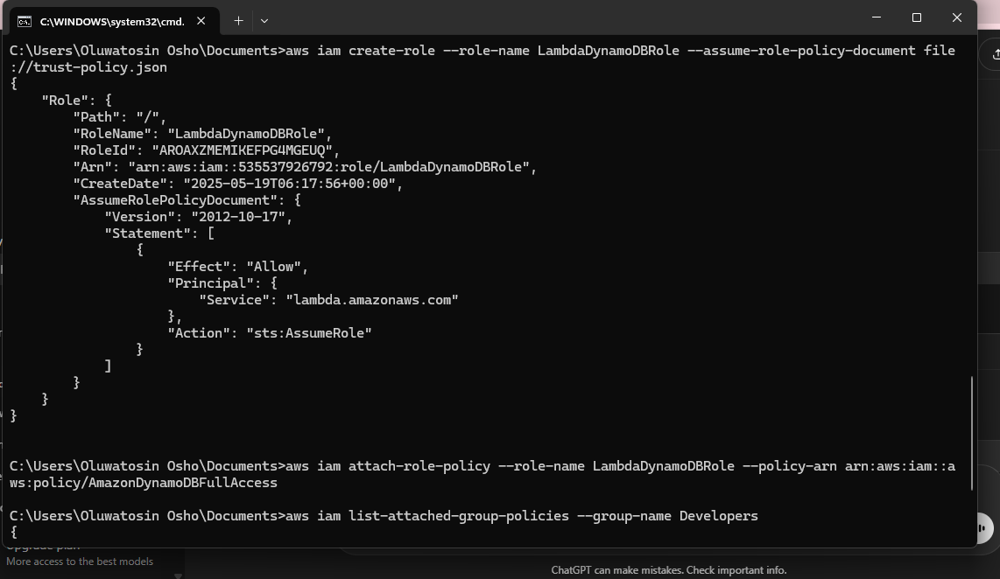
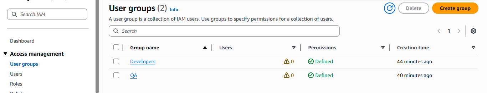

# AWS IAM: Taking Control with CLI Automation for Rock-Solid Security
### Building Least Privilege, Step by CLI Step

---

## 🚀 Project Overview
I didn’t just click around AWS Console, I built a secure, scalable IAM provisioning system using AWS CLI automation.

Why? Because too many permissions create massive security risks and operational headaches. Automating roles and policies means zero guesswork, no over permissioning, and fully auditable access control, essential for any serious cloud environment.

---

## 🔐 Core Security Principles Applied
* **Role Based Access Control (RBAC):** Setup users, groups, and roles granting only exactly what’s needed, no excess access.
* **Smart Policy Management:** Combined AWS managed policies with custom ones for precise control.
* **Service to Service Trust:** Configured Lambda roles with trust policies to securely access DynamoDB without hardcoded credentials.
* **Ironclad Least Privilege:** Every permission granted was the absolute minimum, dramatically shrinking the attack surface.
* **IAM Best Practices:** Enforced MFA and strong password policies to boost security beyond just permissions.

---

## ⚙️ How I Automated It (AWS CLI)
This whole setup was done purely through the AWS CLI. It's my way of proving I can build infrastructure as code, reliably and repeatedly. Here’s the rundown:

* Scripted creation of Developer and QA groups with tailored AWS managed policies (S3 Full Access for Devs, EC2 Read-Only for QA).
    

* Configured Lambda execution role with a trust policy JSON to enable secure DynamoDB access.
    

* Verified everything via AWS Console post deployment manual checks still matter.
    

* All commands documented in a reusable shell script ([`iam-commands.sh`](./iam-commands.sh)).

---

## 📈 Impact & Key Learnings
* Mastered repeatable security automation with AWS CLI, eliminating manual drift and human error.
* Put least privilege into real practice, reducing risk and boosting security confidence.
* Gained confidence designing identity solutions that balance security with operational efficiency.

---

## 🔜 Next Steps
* Diving deep into Amazon S3 lifecycle policies, versioning, static hosting, and advanced security controls.
* I’m also exploring policy as code tools to automate compliance and continuous validation.
* Always learning, always building.

---

## 📂 Repository Contents
* `trust-policy.json` — Lambda assume role policy JSON
* `iam-commands.sh` — Automated CLI provisioning script
* `screenshots/` — Visuals of CLI outputs and AWS Console verification 
* `README.md` — This document

---

## 📫 Connect With Me
Oluwatosin Awotona |www.linkedin.com/in/awotona-oluwatosin-b5485b173| 

---

*Building automated, precise cloud security that scales and protects.*